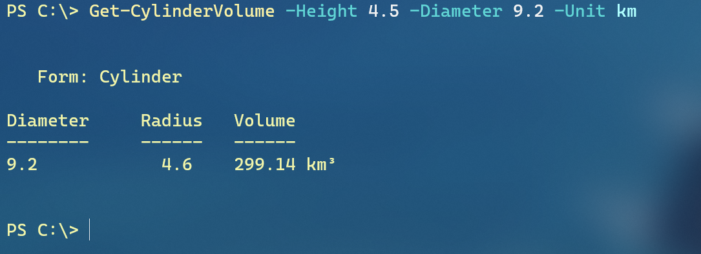

# PSBackToSchool


This module contains a sample solution to an Iron Scripter PowerShell challenge described at [https://ironscripter.us/powershell-back-to-school-scripting-challenge/](https://ironscripter.us/powershell-back-to-school-scripting-challenge/).

## Custom Formatting

Because your functions should always be writing objects to the pipeline, you may want to include some custom formatting. This module includes a custom formatting file for objects from `Get-CylinderVolume`.



The actual object looks like this:

```powershell
Get-CylinderVolume -Height 4.5 -Diameter 9.2 -Unit km | Select-object *


Form      : Cylinder
Diameter  : 9.2
Radius    : 4.6
Volume    : 299.14
Unit      : km
Formatted : 299.14 km³
```

Custom formatting is defined in specially formatted XML files, typically with a `.ps1xml` extension. The easiest way to create the file is to use the [New-PSFormatXML](https://github.com/jdhitsolutions/PSScriptTools/blob/master/docs/New-PSFormatXML.md) command from [PSScriptTools](https://github.com/jdhitsolutions/PSScriptTools) module. All you need is a representative object with all of the properties you wish to use.

```powershell
Get-CylinderVolume -Diameter 1 -Height 1 |
New-PSFormatXML -FormatType Table -GroupBy Form -Properties Diameter,Radius,Formatted -ViewName default -path .\pscylinder.format.ps1xml
```

You can then edit the ps1xml file. Click [here](formats/pscylinder.format.ps1xml) if you want to see what the format file for this module looks like.

## Help Files

Command help was created using the `Platyps` module which you can install from the PowerShell Gallery. The first step is to create an intermediate set of markdown documents.

```powershell
Import-Module .\PSBackToSchool.psd1 -force
New-MarkdownHelp -module PSBackToSchool -output docs -force
```

Edit the markdown documents and "fill in the blanks". Then you can create an external help file. The output folder is named after the target culture.

```powershell
New-ExternalHelp -Path .\docs\ -OutputPath .\en-us\ -Force
```

## Your Homework

If you want to improve your PowerShell grade, you can clone this repository and add to it. Here is a list of things you could tackle.

+ Add Unit of measurement parameters to the other commands, like `Get-CylinderVolume`.
+ Define aliases for other commands and export them in the module manifest.
+ Add additional custom formatting.
+ Write a series of Pester tests. You might not need to mock anything.

## Additional Reading

If you are looking to take your PowerShell scripting to the next level, you might want to grab a copy of [The PowerShell Scripting and Toolmaking Book](https://leanpub.com/powershell-scripting-toolmaking). Or if you are still getting your feet wet with PowerShell and would like to test skills, [The PowerShell Practice Primer](https://leanpub.com/psprimer) may be what you need.

Last updated *2020-09-08 14:21:07Z*.
